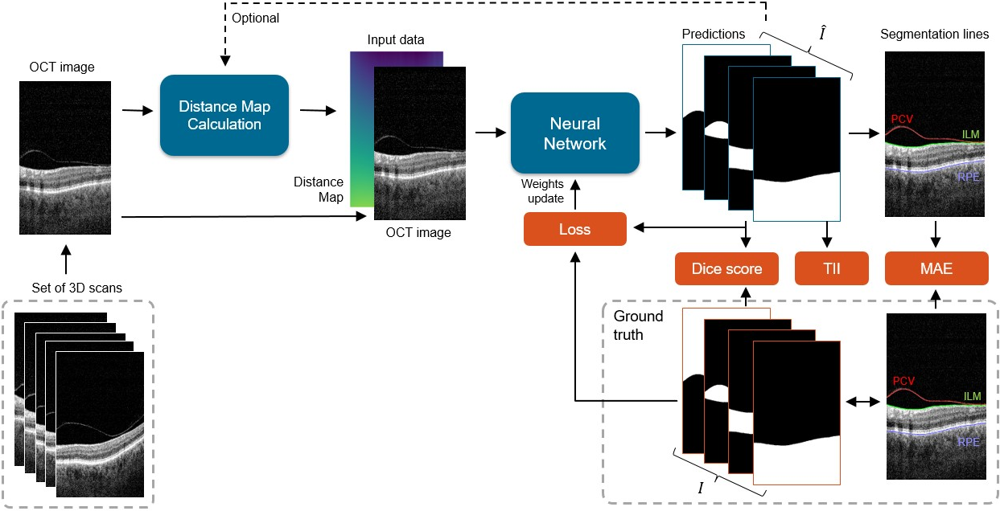
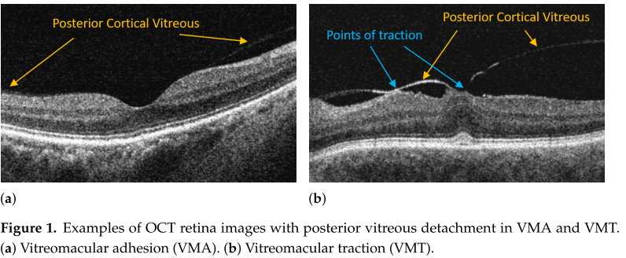
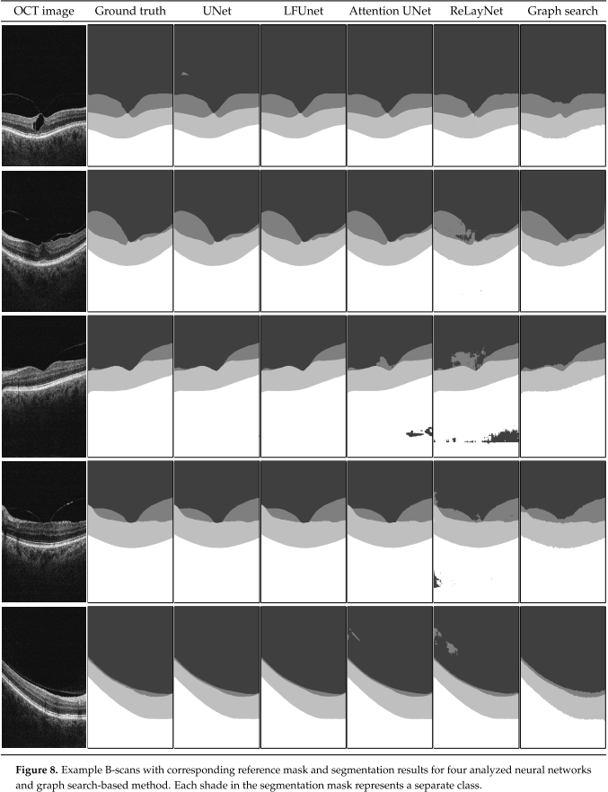

# Preretinal space segmentation from OCT images using convolutional neural network (U-net)

This repository contains the implementation of a convolutional neural network used to segment preretinal space area in OCT retina images. This is a semantic segmentation task: the neural network predicts to which region (class) each pixel in the OCT image belongs. For this task 4 classes are defined: {*Vitreous, Preretinal Space, Retina, Region below the Retina*}. 



This code was developed for the paper [1]:

*Stankiewicz, A., Marciniak T., Dabrowski A., Stopa M., Marciniak E., and Obara B., "Segmentation of Preretinal Space in Optical Coherence Tomography Images Using Deep Neural Networks", Sensors, vol. 21, no. 22: 7521, 2021, [link](https://doi.org/10.3390/s21227521)*.

It tests 5 neural network structures derived from the *U-Net* architecture.
* Original U-Net [2]
* LF-UNet [3]
* ReLayNet [4]
* Attention Gates UNet [5]
* DRUNet [6].

## Dataset

The performance of this neural network is tested on the CAVRI database (subset CAVRI-A) [7], and (to the best of our knowledge) is the first method developed to segment the preretinal space region from the OCT images using convolutional neural networks.

The CAVRI dataset consists of three-dimensional cross-sections of the 
macula imagined using the Avanti RTvue OCT device. The cohort includes 
* 23 healthy volunteers (25 eyes) with partial separation of the vitreous (Vitreomacular Adhesion - VMA), and 
* 23 patients (25 eyes) with the specific disease of Vitreomacular Traction - VMT 

giving 46 subjects (50 eyes) in total. Each set of 3D OCT scans was acquired with 
*3D Retina* scanning protocol comprising of 141 B-scans with 640x385 px resolution representing 2x7x7 mm volume. The whole CAVRI-A dataset consists of 7050 images. 

Subjects for this dataset were recruited at the Department of Ophthalmology, Chair of
Ophthalmology and Optometry, Heliodor Swiecicki University Hospital, Poznan University
of Medical Sciences in Poznan, Poland. The study was approved by the Bioethics Committee
of Poznan University of Medical Sciences under resolution no. 422/14. All participants signed
an informed consent document before enrollment.

Except for normalization transform (see `train.py`) no preprocessing was performed on the images.



### Reference data
In addition, the experts performed manual segmentation of the retinal layers to provide reference data for image segmentation accuracy 
analysis. Three lines were segmented for each image:
* PCV - Posterior Cortical Vitreous - border between the *Vitreous* and the *Preretinal Space*
* ILM - Inner Limmiting Membrane - inner border of the retina
* RPE - Retinal Pigment Epithelium - outer border of the retina.

The ground truth data is also provided with the CAVRI dataset [7].

## Requirements
* Python 3.7
* `conda install pytorch==1.9.0 torchvision==0.10.0 torchaudio cudatoolkit=11.1 -c pytorch -c nvidia -c conda-forge`
* `pip install -r requirements.txt`

Extract the OCT images from the CAVRI-A dataset to the `dataset50anon` folder, and groun truth data to the `ground_truth50anon` directory. 

The project tree should have the following structure:
```
pcv_segmentation
│
└───dataset50anon (OCT data)
│    └───VMA_0001S_20160715103809
│    │    ├───Skan_nr_1.tiff
│    │    ├───Skan_nr_2.tiff
│    │    └───...
│    └───VMA_0002D_20160920124457
│    └───VMA_0003D_20170703205804
│    └───...
│
└───ground_truth50anon (reference retina borders segmentations)
│    ├───VMA_0001S_20160715103809.json
│    └───VMA_0002D_20160920124457.json
│    └───...
│
└───saved_model (folders with trained models)
│    ├───UNetOrg_k33_a3_32_lr=0.000005
│    └───[network]_k[kernel_size]_[anomaly?]_[features_number]_[augemntations?]_lr=[learning_rate]
│    └───...
└───tb_logs (a directory to which TensorBoard stores the log data)
└───train.py
└───test_model.py
└───predict_new_gt.py
└───...
```

Due to large images they are not loaded all into the memory, but read and processed as needed from the drive.

## Training 
The training is performed on whole images (640x384 px) due to the fact that the pixels in *Preretinal Space* are of similar intensity to those in *Vitreous* and *Region below Retina*.
All 7050 cross-sections (also called B-scans), visualized as gray-scale images, were analyzed separately.

Each network was trained for at least 50 epochs, and the training was stopped if the validation loss did not decay for the last
five epochs. Models were evaluated on the best checkpoint corresponding to the lowest
validation loss value. It should also be noted that due to memory constraints, all networks
were implemented with 32 initial feature vectors instead of the original 64.

### Data split
The CAVRI dataset was randomly split into training, validation, and testing subsets
with the ratio of 80%, 10%, and 10%, respectively. The images in the training set were used
to learn the neural network weights. The validation set was used at the end of each epoch
to check the model’s accuracy and validation loss. Finally, the test set contains images
previously unseen by the network and is used to evaluate all segmentation methods.
The split information is provided in the `split50*.json` files (see `split50win_anon.json` for Windows and `split50lin_anon.json` for Linux).

### Loss function
The default loss function is Weighted Dice and Cross-Entopy. The Weighted Cross Entropy and Weighted Dice losses were also tested using this code. The results were included in the PhD dissertation of the main developer [8].
The weights calculation for each class is described in the paper [1]. 

### Data augmentation
We utilized data augmentation techniques during training to improve the model’s
generalisability and increase the segmentation accuracy. The following transformations
performed in 2D for each cross-section were used:
* Horizontal flip
* Rotation of a random value within +- 20 degrees
* Vertical translation of a random value within 10% of image height
* Crop with random dimensions within 80-100% of image dimmensions.

Utilizing 4 data augmentation techniques allowed to increase the number of
training examples from 5608 to 27170. 

### Experiment configuration
The paremeters for the experiment are set in the `train.py` file. 
You need to provide the following information:

```
params_train = {
    'LEARNING_RATE': 0.000005,
    'network': 'UNetOrg',   # UNetOrg / LFUNet / AttUNet / DRUNet / ReLayNet / FCN8s
    'kernel': (3, 3),       # (3, 3) / (7, 3) / ...
    'features': 32,         # 16 / 32 / 64
    'augment': None,        # (["FlipH", "Translate", "Rotate", "CropRandom"])  # "CropFixed"
    'distance_map': None,   # 'BasicOrient' / 'CumSum' / '2NetR' / '2NetPR'
    'batch': 1,             # if data augmentation is used -> batch must be 1, otherwise can be bigger
    'N_CLASSES': 4,         # to how many segments the OCT image is divided (1 more than searched borders)
    'anomalies': None  # "anomalies50anona3.csv"      # remove anomalous samples listed in .csv file from the dataset
}
```
These parameters will be also included in the experiment name and saved model file name and tensorboard folder name. 
In the `train.py` file you also define:
- split (.json) file to use
- how many gpus to use (`pl.Trainer(gpus=1,... `)
- number of epochs (minimum and maximum)

The TensorBoard logger is used to save the loss, accuracy and F1 scores during training, validation and test. Also examples of the segmented images are save to the TensorBoard log file. The logs for each experiment are saved in the tb_logs directory.
To open TensorBoard run: `tensorboard --logdir=tb_logs` in the console.

After all the parameters have been configured, you can train the neural network with:
```
python train.py
```

The following files will be saved in the `saved_model/[experiment_name]/` directory:
- trained model (for example: `epoch=50-val_loss=0.1072.ckpt`)
- train_loss.csv (training loss for each epoch)
- val_loss.csv (validation loss for each epoch)

### Evaluate the trained model
The performance of the trained model is evaluated against the test subset of the CAVRI-A dataset, listed in the `split*.json` file.

The parameters for the testing can be set in the `test_model.py` file, in the same was as in the `train.py` file.

**Since the train parameters are included in the saved model folder and file names it is important to setup the same parameters for the test as they were for the training step.**

Run testing by:
```
python test_model.py
```

The following files will be saved in the `saved_model/[experiment_name]/` directory:
- `results.csv` (with accuracy and dice results for all classes, and MAE results for segmented borders)

The evaluation scores with example images will be stored in the TensorBoard log files (either in `tb_logs` or `tb_logs_testall` depending on the `params_test` setup.) 

## Results 

To compare the correctness of the proposed segmentation methods with the manual
annotations, we employ the following evaluation metrics:
* Dice score
* Mean absolute error
* Topology incorrectness index



## Bibliography
[1] Stankiewicz, A., Marciniak T., Dabrowski A., Stopa M., Marciniak E., and Obara B., "Segmentation of Preretinal Space in Optical Coherence Tomography Images Using Deep Neural Networks", Sensors, vol. 21, no. 22: 7521, 2021, [link](https://doi.org/10.3390/s21227521).

[2] Ronneberger, O.; Fischer, P.; Brox, T., "U-net: Convolutional networks for biomedical image segmentation." *In Proceedings of the International Conference on Medical Image Computing and Computer-Assisted Intervention*, Munich, Germany, 5–9 October, pp. 234–241, 2015. 
[paper](https://arxiv.org/pdf/1505.04597.pdf).

[3] Ma D., Lu D., Heisler M., Dabiri S., Lee S., Ding G.W., Sarunic M.V., Beg M.F., "Cascade dual-branch deep neural networks for
retinal layer and fluid segmentation of optical coherence tomography incorporating relative positional map." *In Proceedings of
the Third Conference on Medical Imaging with Deep Learning*, Montreal, QC, Canada, 6–8 July, pp. 493–502, 2020.

[4] Roy A.G., Conjeti S., et al., "ReLayNet: Retinal layer and fluid segmentation of macular optical coherence tomography using fully convolutional networks." *Biomed. Opt. Express*, 8, 3627–3642, 2017.

[5] Schlemper O., Oktay M., "Attention gated networks: Learning to
leverage salient regions in medical images." *Med. Image Anal.* 53, 197–207, 2019.

[6] Devalla S.K., Renukan P.K., et al. "DRUNET: A dilated-residual U-Net deep learning network to segment optic nerve head tissues in optical
coherence tomography images." *Biomed. Opt. Express*, 9, 3244–3265, 2018.

[7] CAVRI Dataset of OCT Images for VMT and VMA Subjects. [link](http://dsp.org.pl/CAVRI_Database/191/).

[8] A. Stankiewicz, "Automatic parameterization of human retina image," PhD dissertation, Poznan University of Technology, 2022, [link](https://bip.put.poznan.pl/attachments/3070/download). 